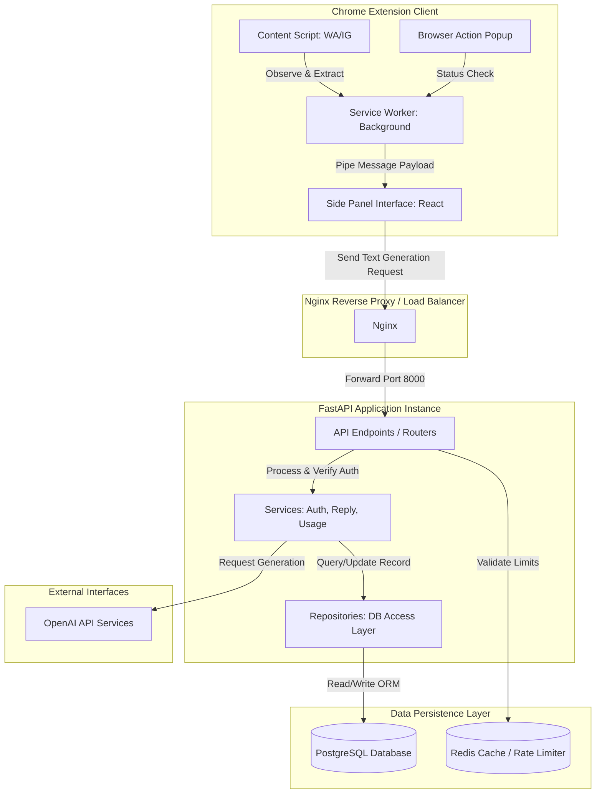

# Wingman AI — System Architecture

This document describes the high-level architecture of Wingman AI, outlining how components interact across the web browser, local storage, API gateway, and backend services.

## System Topology

## Core Modules

### 1. Browser Extension
- **Content Scripts (`src/content/`)**: Extract HTML elements from WhatsApp and Instagram threads, normalize text content, and watch DOM changes using `MutationObserver`.
- **Side Panel (`src/sidepanel/`)**: React-based panel hosting conversation state, account settings, tone selections, and list of recommended responses.
- **Service Worker (`src/background/`)**: Manages the lifespans of extension assets, listens to events (e.g. extension button clicks), and coordinates side panel states.

### 2. Backend Web Application
- **API Routers (`app/api/routes/`)**: Handle requests, format schemas, validate headers, and inject dependencies.
- **Services (`app/services/`)**: Orchestrate business logic, call OpenAI APIs using configured style sheets, and deduct user credit balances.
- **ORM & Database (`app/models/` and `app/repositories/`)**: Manage transactional tables via SQLAlchemy and execute raw SQL statements via repository interfaces.
