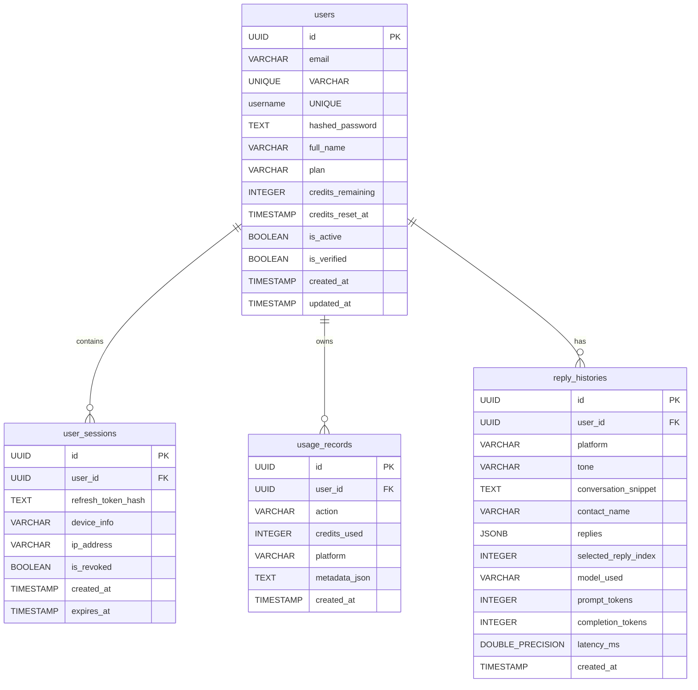

# Wingman AI — Database Schema Reference

This document maps all database schemas, table models, types, relationships, and index configurations.

## Database Diagram

## Tables & Keys

### 1. `users`
- **Primary Key**: `id` (UUID)
- **Indexes**:
  - `idx_users_email` (implicitly generated UNIQUE index)
  - `idx_users_username` (implicitly generated UNIQUE index)
  - `idx_users_is_active` (partial index filtering `is_active = TRUE`)

### 2. `user_sessions`
- **Primary Key**: `id` (UUID)
- **Foreign Key**: `user_id` -> `users.id` (ON DELETE CASCADE)
- **Indexes**:
  - `idx_user_sessions_user_id`

### 3. `usage_records`
- **Primary Key**: `id` (UUID)
- **Foreign Key**: `user_id` -> `users.id` (ON DELETE CASCADE)
- **Indexes**:
  - `idx_usage_records_user_id`
  - `idx_usage_records_created_at` (sort DESC)

### 4. `reply_histories`
- **Primary Key**: `id` (UUID)
- **Foreign Key**: `user_id` -> `users.id` (ON DELETE CASCADE)
- **Indexes**:
  - `idx_reply_histories_user_id`
  - `idx_reply_histories_created_at` (sort DESC)
