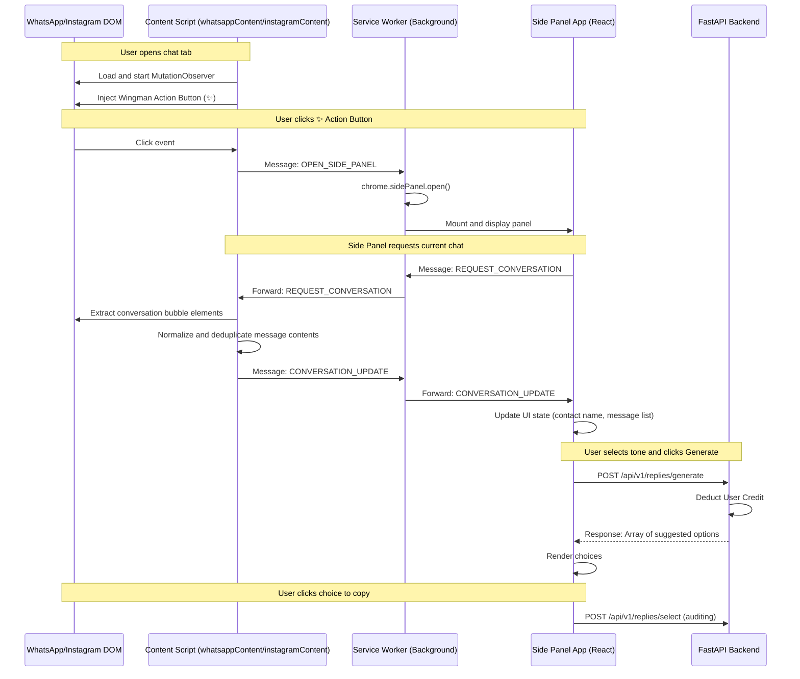

# Wingman AI — Chrome Extension Flow

This document details the step-by-step process of extracting active chat streams from web pages and updating the Chrome Extension UI panel.

---

## Architecture Flow



## Key Operations

### 1. Active Element Extraction
- **WhatsApp**: Scans messages matching `message-in` and `message-out` inside target panels.
- **Instagram**: Scans rows matching `role="row"` or elements aligned by CSS styles.

### 2. Message Normalization
Both extractors translate raw elements into standard JSON arrays:
```typescript
interface Message {
  sender: string;
  content: string;
  direction: 'incoming' | 'outgoing';
  timestamp?: string;
}
```

### 3. IPC Message Channels
Communication runs via `chrome.runtime.sendMessage` and `chrome.runtime.onMessage`:
- `OPEN_SIDE_PANEL`: Sent by content script to background thread to initialize panels.
- `REQUEST_CONVERSATION`: Sent by React component to request content scripts to sweep DOM.
- `CONVERSATION_UPDATE`: Push payload containing active threads.
- `CONVERSATION_CLEARED`: Fires when user switches away to empty screens.
