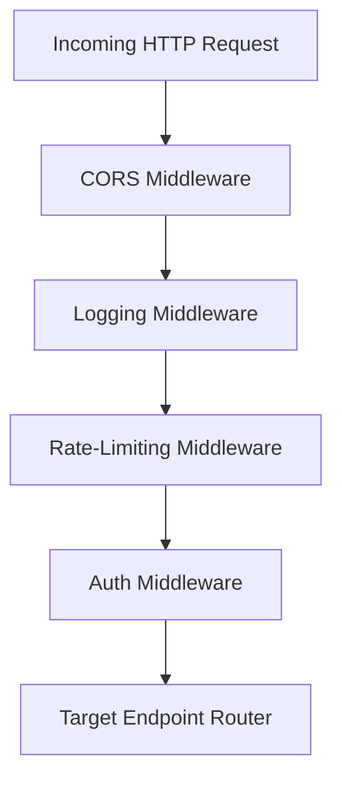

# Wingman AI — Security Architecture

This document details the security layers of the Wingman AI SaaS backend, covering credentials storage, JWT authentication flow, custom middleware, rate-limiting, and CORS configurations.

---

## 1. Authentication Layer

Authentication follows JWT (JSON Web Token) authorization standards.

### Credentials Encryption
- User passwords are encrypted prior to database storage using the standard `bcrypt` hashing algorithm.
- Raw password strings are never logged or stored.

### Dual-Token Architecture
1. **Access Token**: Short-lived JWT (default expiry is 30 minutes) containing encrypted credentials claims (`sub`: User UUID).
2. **Refresh Token**: Long-lived token (default expiry is 7 days) stored securely in user storage and tracked in `user_sessions` tables. This allows single-session revocations.

---

## 2. Custom API Middleware

Incoming API requests route through three cascading layers of FastAPI middleware (defined under `app/middleware/`):

### Rate Limiting
- **Technology**: Redis-backed leaky/fixed window algorithms.
- **Rules**: Rate limits apply dynamically per IP address or user ID. Default configuration blocks requests exceeding 60 requests per minute.
- **Bypass**: Configurable flag `RATE_LIMIT_ENABLED=false` disables the rate-limiter for test runs.

### CORS Security
- The backend controls CORS using FastAPI's `CORSMiddleware`.
- Allow rules filter requests to Chrome Extension schemas (`chrome-extension://*`) and development ports (`localhost:3000`, `localhost:5173`).
- In production, allowed origins restrict to registered domains.

### Authorization Pipeline
- Auth middleware (`app/middleware/auth.py`) extracts bearer tokens from request headers.
- If present and valid, token properties populate context scopes.
- Security dependencies (e.g. `get_current_user_id` inside `app/api/deps.py`) reject operations on invalid/expired credentials.
